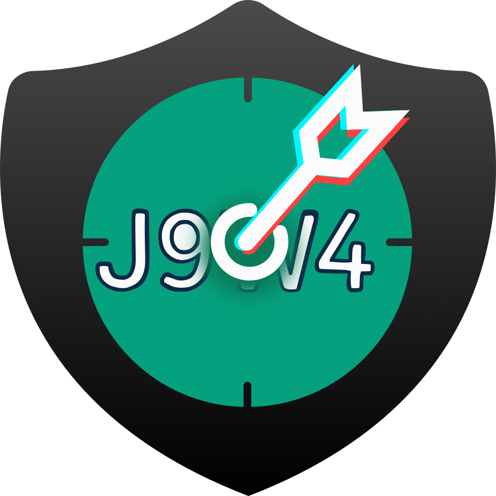

<div align="center">
  <a href="https://github.com/Hiram-Wong/captcha-bypass">
    
  </a>
</div>

<div align="center">
  <p><b><font size="4"><i>Captcha Bypass</i></font></b></p>
</div>

<div align="center">

[![][github-release-shield]][github-release-link]
[![][github-license-shield]][github-license-link]
[![][github-docker-shield]][github-docker-link]
[![][platform-shield]]()

</div>
<div align="center">

[![][deepwiki-shield]][deepwiki-link]
[![][zread-shield]][zread-link]

</div>

## 📌 介绍

基于 `onnxruntime-wasm` 实现跨平台 ONNX 模型推理，通过 Bun 编译为独立二进制。提供 **CLI** 与 **HTTP Server** 两种运行模式。

## 📖 使用

### 部署

#### 方式一：二进制 + 模型

1. 从 [Releases][github-release-link] 下载对应平台的`二进制文件` `models.zip` 模型文件 以及 `public.zip` 静态资源。
2. 将二进制文件与 `models/` `public/` 放在同一目录，结构如下：

```
captcha-bypass/
├── captcha-bypass             # 按实际平台替换
├── models/
│   ├── detect.onnx
│   ├── ocr.onnx
│   ├── ocr.json
│   └── rotate.onnx
└── public/                    # 可选，静态资源
    ├── favicon.ico
    └── robots.txt
```

3. 按需设置环境变量后启动：

```bash
# Cli 模式
RUN_MODE=cli ./captcha-bypass ocr --type text --bg https://example.com/captcha.png # Mac/Linux
RUN_MODE=cli .\captcha-bypass ocr --type text --bg https://example.com/captcha.png # Windows

# Server 模式
RUN_MODE=server ./captcha-bypass # Mac/Linux
set RUN_MODE=server && .\captcha-bypass-win-x64.exe # Windows
```

> 模型文件通过环境变量指定；不设置时默认加载二进制同级 `models/` 目录下的对应文件。

#### 方式二：Docker

```bash
# 拉取镜像
docker pull ghcr.io/hiram-wong/captcha-bypass:latest

# Cli 模式
docker run --rm -e RUN_MODE=cli ghcr.io/hiram-wong/captcha-bypass:latest ocr --type text --bg https://example.com/captcha.png

# Server 模式
docker run -d -p 7788:7788 -e RUN_MODE=server ghcr.io/hiram-wong/captcha-bypass:latest
```

> 模型已内置于镜像，无需额外挂载。通过 `-e` 传环境变量覆盖配置。

<details>
<summary>展开查看环境变量</summary>

### 环境变量

> Cli 与 Server 模式共用环境变量配置。

| 配置               | 类型                                                        | 默认值                      | 说明                                                              |
| :----------------- | :---------------------------------------------------------- | :-------------------------- | :---------------------------------------------------------------- |
| RUN_MODE           | `"cli"` \| `"server"`                                       | cli                         | 运行模式<br>cli: 命令行；server: HTTP 服务                        |
| NODE_ENV           | `"development"` \| `"production"`                           | development                 | 运行环境                                                          |
| LOG_LEVEL          | `"silly"` \| `"debug"` \| `"info"` \| `"warn"` \| `"error"` | info                        | 日志级别<br>从低到高：silly < debug < info < warn < error         |
| PORT               | `number`                                                    | 7788                        | 服务端口（仅 server 模式）                                        |
| OPENAPI_ENABLE     | `boolean`                                                   | false                       | 是否启用 OpenAPI 文档（仅 server 模式）                           |
| AUTH_TYPE          | `0` \| `1` \| `2`                                           | 0                           | 认证类型<br>0: 不启用；1: 固定值；2: 时间戳随机签名(3分钟)        |
| AUTH_KEY           | `string`                                                    | 空字符串                    | 认证密钥<br>AUTH_TYPE=1/2 时使用                                  |
| DETECT_MODEL_PATH  | `string`                                                    | `models/detect.onnx`        | Detect 模型文件路径                                                |
| DETECT_SHAPE       | `number[]`                                                  | `[3,416,416]`               | 模型输入尺寸 [C,H,W]                                               |
| DETECT_MEAN        | `number[]`                                                  | `[0,0,0]`                   | 均值标准化                                                         |
| DETECT_STD         | `number[]`                                                  | `[1,1,1]`                   | 标准差标准化                                                       |
| OCR_MODEL_PATH     | `string`                                                    | `models/ocr_ppv5-cn.onnx`  | OCR 模型文件路径                                                   |
| OCR_CHARSET_PATH   | `string`                                                    | `models/ocr_ppv5-cn.json`  | OCR 字符集文件路径                                                 |
| OCR_CHARSET_RANGES | `string`                                                    | 空字符串                    | OCR 字符集范围过滤<br>如 `"0123456789"`；按字符拆分后过滤识别结果 |
| OCR_SHAPE          | `number[]`                                                  | `[3,48,320]`                | 模型输入尺寸 [C,H,W]<br>ppocr: `[3,48,320]`; ddddocr: `[1,64,0]`  |
| OCR_MEAN           | `number`                                                    | `0.5`                       | 均值标准化                                                         |
| OCR_STD            | `number`                                                    | `0.5`                       | 标准差标准化                                                       |
| OCR_CTC_LAYOUT     | `"ntc"` \| `"tnc"`                                          | `ntc`                       | CTC 布局<br>ppocr: ntc / ddddocr: tnc                              |
| ROTATE_MODEL_PATH  | `string`                                                    | `models/rotate.onnx`        | ROTATE 模型文件路径                                                |
| ROTATE_SHAPE       | `number[]`                                                  | `[3,224,224]`               | 模型输入尺寸 [C,H,W]                                               |
| ROTATE_MEAN        | `number[]`                                                  | `[0.485,0.456,0.406]`      | 均值标准化                                                         |
| ROTATE_STD         | `number[]`                                                  | `[0.229,0.224,0.225]`      | 标准差标准化                                                       |
| OPENAI_BASE_URL    | `string`                                                    | 空字符串                    | OpenAI API 地址<br>仅支持 `/chat/completions`                     |
| OPENAI_API_KEY     | `string`                                                    | 空字符串                    | OpenAI API 密钥                                                   |
| OPENAI_OCR_MODEL   | `string`                                                    | PaddleOCR-VL-1.6           | OCR 专用模型名称<br>推荐：PaddleOCR、HunyuanOCR、DeepSeek-OCR     |
| OPENAI_MODEL       | `string`                                                    | gpt-5.5                     | 通用模型名称                                                      |

</details>

### 参数说明

> Cli 与 Server 模式共用参数体系。

| 说明       | 接口              | 方法 | 模式         | 参数                                                                                                     |
| :--------- | :---------------- | :--- | :----------- | :------------------------------------------------------------------------------------------------------- |
| 目标检测   | `/captcha/detect` | POST | CLI / Server | type(必传): detect / match<br>bg(必传)<br>thumb(match 必传)                                              |
| 文本验证码 | `/captcha/ocr`    | POST | CLI / Server | type(必传): text / math<br>bg(必传)<br>action(可选, 默认 onnx): ai / onnx<br>range(可选): 识别字符集范围 |
| 旋转验证码 | `/captcha/rotate` | POST | CLI / Server | type(必传): single/ nox / tiktok<br>bg(必传)<br>thumb(nox/tiktok 必传)                                   |
| 滑动验证码 | `/captcha/slide`  | POST | CLI / Server | type(必传): match / comparison<br>thumb(必传)<br>bg(必传)                                                |
| 健康检查   | `/health`         | GET  | Server       |                                                                                                          |
| MCP 协议   | `/mcp`            | POST | Server       | Streamable HTTP 传输，body：JSON-RPC 2.0 消息（详见工具列表）                                            |

### 调用说明

- Cli:
  - 图片: 支持Base64/URL/文件路径
- Server:
  - 授权: `Authorization: Bearer <token>`
  - 图片:
    - Base64/URL: `Content-Type: application/json`
    - 文件: `Content-Type: multipart/form-data`

<details>
<summary>展开查看常见问题</summary>

#### 识别不准确？

- 使用onnx部分由模型决定的，请自行使用 [dddd_trainer](https://github.com/sml2h3/dddd_trainer) 工具训练特定场景专属数据模型。
- 使用opencv部分为非通用场景, 特定场景需请自行完成算法匹配。

#### 算术识别不准确？

- 算术识别也与模型挂钩。
- 只支持整数四则运算(加减乘除), 不支持其他运算(取余开方取余)等计算。
- onnx: 对`+`和`*`错误率较高, 建议根据给出的公式手动替换符号再次计算。
- ai: 部分模型对提示词理解能力较差, 字符集范围不生效

</details>

<details>
<summary>展开查看命令示例</summary>

```bash
./captcha-bypass -h # 帮助
./captcha-bypass -V # 版本号

# 文字
./captcha-bypass ocr --type text --bg https://example.com/captcha.png
./captcha-bypass ocr --type text --bg ./captcha.png --range 0123456789
./captcha-bypass ocr --type math --action ai --bg "data:image/png;base64,..."

# 目标
./captcha-bypass detect --type detect --bg https://example.com/captcha.png
./captcha-bypass detect --type match --bg ./bg.png --thumb ./thumb.png

# 旋转
./captcha-bypass rotate --type single --bg https://example.com/captcha.png
./captcha-bypass rotate --type nox --bg ./bg.png --thumb ./thumb.png
./captcha-bypass rotate --type tiktok --bg "data:image/png;base64,..." --thumb "data:image/png;base64,..."

# 滑块
./captcha-bypass slide --type match --bg https://example.com/bg.png --thumb https://example.com/thumb.png
./captcha-bypass slide --type compare --bg ./bg.png --thumb ./thumb.png
```

</details>

<details>
<summary>展开查看请求示例</summary>

#### 目标

```bash
curl -X POST 'http://127.0.0.1:7788/captcha/detect' -H 'Content-Type: multipart/form-data' \
-F 'type=detect' \
-F 'bg=https://camo.githubusercontent.com/3d8846970916d08d38ef3b02ff5ab0782f51ea78e1bcff8b14b9e2bfad5b9496/68747470733a2f2f667265652e70696375692e636e2f667265652f323032352f30372f33302f363838393732643639643363312e6a7067'
# {"status":0,"data":[{"target":"data:image/png;base64,...","coordinate":{"x1":246,"y1":47,"x2":287,"y2":87}}, ...],"msg":"success"}
```

```bash
curl -X POST 'http://127.0.0.1:7788/captcha/detect' -H 'Content-Type: multipart/form-data' \
-F 'type=match' \
-F 'bg=https://camo.githubusercontent.com/.../bg.jpg' \
-F 'thumb=https://camo.githubusercontent.com/.../thumb.jpg'
# {"status":0,"data":[{"target":"data:image/png;base64,...","coordinate":{"x1":14,"y1":101,"x2":99,"y2":217}}, ...],"msg":"success"}
```

#### 文本

```bash
curl -X POST 'http://127.0.0.1:7788/captcha/ocr' -H 'Content-Type: application/json' -d '{
  "type": "text",
  "action": "onnx",
  "bg": "https://images2018.cnblogs.com/blog/1047463/201804/1047463-20180406163706898-1017943434.png",
  "range": "0123456789"
}' # {"status":0,"data":{"code":"0413"},"msg":"success"}
```

```bash
curl -X POST 'http://127.0.0.1:7788/captcha/ocr' -H 'Content-Type: application/json' -d '{
  "type": "math",
  "action": "ai",
  "bg": "data:image/jpeg;base64,/9j/4AAQSkZJRgABAgAAAQABAAD/2wBDAAgGBgcGBQgHBwcJCQgKDBQNDAsLDBkSEw8UHRofHh0aHBwgJC4nICIsIxwcKDcpLDAxNDQ0Hyc5PTgyPC4zNDL/2wBDAQkJCQwLDBgNDRgyIRwhMjIyMjIyMjIyMjIyMjIyMjIyMjIyMjIyMjIyMjIyMjIyMjIyMjIyMjIyMjIyMjIyMjL/wAARCAAcAIIDASIAAhEBAxEB/8QAHwAAAQUBAQEBAQEAAAAAAAAAAAECAwQFBgcICQoL/8QAtRAAAgEDAwIEAwUFBAQAAAF9AQIDAAQRBRIhMUEGE1FhByJxFDKBkaEII0KxwRVS0fAkM2JyggkKFhcYGRolJicoKSo0NTY3ODk6Q0RFRkdISUpTVFVWV1hZWmNkZWZnaGlqc3R1dnd4eXqDhIWGh4iJipKTlJWWl5iZmqKjpKWmp6ipqrKztLW2t7i5usLDxMXGx8jJytLT1NXW19jZ2uHi4+Tl5ufo6erx8vP09fb3+Pn6/8QAHwEAAwEBAQEBAQEBAQAAAAAAAAECAwQFBgcICQoL/8QAtREAAgECBAQDBAcFBAQAAQJ3AAECAxEEBSExBhJBUQdhcRMiMoEIFEKRobHBCSMzUvAVYnLRChYkNOEl8RcYGRomJygpKjU2Nzg5OkNERUZHSElKU1RVVldYWVpjZGVmZ2hpanN0dXZ3eHl6goOEhYaHiImKkpOUlZaXmJmaoqOkpaanqKmqsrO0tba3uLm6wsPExcbHyMnK0tPU1dbX2Nna4uPk5ebn6Onq8vP09fb3+Pn6/9oADAMBAAIRAxEAPwD169vddvbx7bTtIhW3ilBF3fPiOQL97ag+cMGwVJAB25BwRnGu9P1m51W1stX8ZCxu7tXks7WwQR79oBkUFuX25GO+MnHXE3jbxaPB3hubXL+S4gSSQR29nGimaSYqcKXJdFUhSxIHAHc8N4L4F0/Vofj1p0Ws5bU7lnu7rDtAytNbNM2doBVgH5UADII6c1Mb3en37f16lKo+it/Xfc9v1Lw3HpMSXes+PLiCAt5StqLQeWxPO3Eg2k/LnH+zntVw/wDCS6VIsbOlwoUyu0Uj7Bz0xKJCcgd5YxwfufeOb498B+G5fDOv6zPpay39tpVz5E0s8khTCvJkBmwDvLHPXk88mub/AGeVvv8AhAL9raW3CDVJMxyRsSx8qL+IN8v/AHyce/Si91dr7hKrUS3v66ndx+LL+GOGOXSrmdydrypbzEDgncfKjkTsB8jtyeQOQrpvEt/PBLHbadcRTMpxILacFOOT++iij4Az8zj8eFOhcyafb/vL+3ZPIQNM32R5lwFOd0pQ7lxg54Py89xWXqeu+EodXsdMvZ3GoswmtLGd5Id55QbVkKpzuICnrggAkUuem9Ob5f1qL2+nwK/q9/T9CN/+EhvrkCXUbW3hAZmhVnnlVsjAKQeWUAG4EGSQZwMn71T2WhQ2tzLJHqF4j7h5DxaTDG0a7NpBbyeSW3NnjsMYB3Vdd8U6tY6tpej6Fpdlc6neSIxtZLlx5NmpO+V9qbYx/CGBbJOFD4xXQrp+prKZft9mZWRUeT7EQzqucAkPnqzH23HGM0+ZbpP+vWwfWKzXu7eS/wA2ZEtjdSTxkX8d0csQusWyxylwQFELxqhQsBy+HK4TC9RUUh1Wxt4otRF5CXUB3sp2u4HfGc4JW5z8p+VCQBySRux5f8abXxFa+K9CSfxLPb6PqbRwsIZXiigdJFJdlZwvG5WDM2cqeVCg1Z8QeJNZ+EPiPTV/tPU9Q0TUQ73Nvqs0Vxdq42q0isuPl27NqlsEq4OODTvFu21+5UK9SKtLX0/qx3k+24j2Pd6sBzg/2VqLZyCOhc+p6/yPN1JdRnh8u1ttRu1UFl+03DWSN9PvXAOTjEmFPJyBtrZSK7t98J1GO6lVhI0bKyuFdzj7pyF6gEg4C+xrG8QeL/DvhiSJtd1yz0+4C7EhiXzrhA3JzgM207Mk7QMgc+r9lBS0f5hLF1Ho1r8vPt/mW7DQtUDzyS30Wm+YwYLpsas78f8ALWSZX3kHIBAXPLHlsC2+g3jyM3/CS6uAxJ2hbfaPbBh6V5RffGHRri7DeHPCGqa+bWWXdcuWjWNmDN5kYCvtLKsrZ2owAb/ax6zoSm+0my1K4tL6xubmJJ5LS4upGaFioypBPb0wPcAkiqtFbEynUk7ySfr/AMMPOhW97bqNXitry52lGlWIpxk425ZmHB/vdckYzV6UC9sHFvMuJoj5cqsSORwwKkHHOeCD6EdaxPE2i3msWsFrZ65e6bcJI1wLiKASAhTuVSMbMCTyjg/Myoy5wzGuBh8eeIvBXxF0vwV4luoNbtb5Ylg1CK3ME4aRtiF1ztIDAg45xg5JBWpfmHM9EevqwZQykFSMgjoaKRHSWNZI2V0YBlZTkEHoQaKAPNfGei+N9S8f6fd6TBpNzpFhbCe3XU9/kR3e4jdsjO55AvKsw2qCcYbk+Yx+F/EevfH26h1C+vUukCve6lpCNAtqWtdyIr4OxeBGC3LAc8k19L+TF5wm8tPNAK79o3YOMjP4D8hTIXZ5bhWOQkgVfYbVP8yae4tXucJ8RvEMtvpGq+H7fQvEWqT3unSxpPp9l5sEbyKyhXZSCCOCRg8MDzmuN/Z91rSLLwfc2F1rNna31xqrCK2kuI0klzHEF2q3JycgY717kqhRgepPT1OazLnw5o97qtvql3ptpcXtsMQzzQrI6fNvBDMCRtOSMHjJxSuydLalwfaGmKHKxLn5zjcx4IwORjlhzg5XoQc1wPxPsPDl/wCEp73XbR9WljkNrpsVpPtme4c7AkeP4933lw4/dZ2kgiuz1+5fT/DmrXqqkzQ2ksyxzLlDtQnaQMZBxzz3NRXfhnTr7xRp3iG4E7X2nRSxW485vLXzBhm2ZxuxkZ7g852rtb21HybM8i8NQa/8MfEUF54m0e81c60LcXGuQ77m4tmZVQ28o+fIEhjA2kFsDBfARfapYRCpeK2YrDumjjgk2GSQhtwIyFOd2fmOCxycEA0to5vLKzuZMhyiy4RiBkrzxnkcng57HqBVqjZlJ3R4L8dtFvLjxXoV/fTXieFJBDFqD24dlttspBkcBSoO2bCk5JO4Y9ea8Z2Hw68JeOfDeq6Qljq+iHd9u020vPtGGQ8OSXbOd4Ow4U+UQeGOPpq4t4bu3kt7mJJoJFKSRSDcrqRgqwPBBBPBrjLH4e+DNVZtQn8L6WsyTS24WGHZHtiuG2koDt3HYMnGSMqflOKQ9bXOo/sXTIoHSDSrEZBOzyVVWJOecDucEnBry/4h6NqT+LIIvDfgCy1i7Fkjfbb9Fa1ihErFoFjbbHvLfNuyXxI2MDBHrNwzh4EViu+TBIAzgAtjn1xj6E9DzVPw7eSaj4a0y/lAEt3ax3EgUkgM6hiBkkgZJwM8DAqUo321IsrnlNv4G+JOvtHDqnje38Px28KyQadowKm2R+FjZYynyrsKqSz/AHTg9SfVdB0z+xdKtdNOZXt7aFJbwqF+0uqBCxGSd2EXOexAycHE96fsWiXJj3HybZtu+Rixwpxls7ieOuc+9Xaq+ppbQyvEVz9m0K/kGoy6a0VpLP8AbVt/OEARclipBDYznb1bBx3ry/4K+BPDVlHd69a39trtwJzHaXixOohjGP4HUFJSc55JClCCA3zek+L4refwvd293aw3VtOY4ZYZgdrK8iqehBBGcgg5BAPaqXgLw9pnhzRr230mA29tLqNw/k72dUKN5IwWJbkRAnJPJOMDACv0JtdHU0UUUwP/2Q=="
}' # {"status":0,"data":{"formula":"41*8","result":328},"msg":"success"}
```

#### 旋转

```bash
curl -X POST 'http://127.0.0.1:7788/captcha/rotate' -H 'Content-Type: application/json' -d '{
  "type": "single",
  "bg": "https://github.com/chencchen/RotateCaptchaBreak/blob/master/data/baiduCaptcha/1615096444.jpg?raw=true"
}' # {"status":0,"data":{"cw":253,"ccw":107},"msg":"success"}
```

```bash
curl -X POST 'http://127.0.0.1:7788/captcha/rotate' -H 'Content-Type: application/json' -d '{
  "type": "nox",
  "thumb": "https://aisearch.cdn.bcebos.com/fileManager/Kd4NhrVAnd-Xb07XyhFDNyL8o8W6ok-5XB3BKJCkBzA/17812845752526QDSku.png",
  "bg": "https://aisearch.cdn.bcebos.com/fileManager/Kd4NhrVAnd-Xb07XyhFDNyL8o8W6ok-5XB3BKJCkBzA/1781284569883njSOO4.png"
}' # {"status":0,"data":{"cw":85,"ccw":275},"msg":"success"}
```

```bash
curl -X POST 'http://127.0.0.1:7788/captcha/rotate' -H 'Content-Type: application/json' -d '{
  "type": "tiktok",
  "thumb": "https://github.com/ycq0125/rotate_captcha/blob/main/imgs/inner_5.png?raw=true",
  "bg": "https://github.com/ycq0125/rotate_captcha/blob/main/imgs/outer_5.png?raw=true"
}' # {"status":0,"data":{"cw":325,"ccw":35},"msg":"success"}
```

#### 滑块

```bash
curl -X POST 'http://127.0.0.1:7788/captcha/slide' -H 'Content-Type: application/json' -d '{
  "type": "match",
  "thumb": "https://camo.githubusercontent.com/0db95c4247a43b41d5f3e3c9068856df40eaf6339fcfb86988a122b49939a4af/68747470733a2f2f63646e2e77656e616e7a68652e636f6d2f696d672f612e706e67",
  "bg": "https://camo.githubusercontent.com/9fb4d767ad341b1d594c30dbe284aaddc131204ae0cc9f3b82968a88ccd67b79/68747470733a2f2f63646e2e77656e616e7a68652e636f6d2f696d672f622e706e67"
}' # {"status":0,"data":{"x":214,"y":0},"msg":"success"}%
```

```bash
curl -X POST 'http://127.0.0.1:7788/captcha/slide' -H 'Content-Type: application/json' -d '{
  "type": "compare",
  "thumb": "https://camo.githubusercontent.com/53c5f15724fe306bca6b903cb5f2b74990cb6a620690f4b19ad26ff464706dbc/68747470733a2f2f63646e2e77656e616e7a68652e636f6d2f696d672f62672e6a7067",
  "bg": "https://camo.githubusercontent.com/ac0c1a2501a0aaa3d58e561aefea4a410f59849fa16afd652d7d06c7e0ad4e81/68747470733a2f2f63646e2e77656e616e7a68652e636f6d2f696d672f66756c6c706167652e6a7067"
}' # {"status":0,"data":{"x":142,"y":66},"msg":"success"}
```

</details>

<details>
<summary>展开查看MCP调用</summary>

MCP 端点遵循 [Model Context Protocol](https://modelcontextprotocol.io) 协议，使用 Streamable HTTP 传输 JSON-RPC 2.0 消息。所有请求发送到 `POST /mcp`，直接返回 JSON-RPC 响应。

#### 1. 初始化

```bash
curl -X POST 'http://127.0.0.1:7788/mcp' \
  -H 'Content-Type: application/json' \
  -d '{
    "jsonrpc": "2.0",
    "id": 1,
    "method": "initialize",
    "params": {
      "protocolVersion": "2024-11-05",
      "capabilities": {},
      "clientInfo": { "name": "client", "version": "1.0" }
    }
  }'
```

#### 2. 获取工具列表

```bash
curl -X POST 'http://127.0.0.1:7788/mcp' \
  -H 'Content-Type: application/json' \
  -d '{
    "jsonrpc": "2.0",
    "id": 2,
    "method": "tools/list"
  }'
```

#### 3. 调用 OCR 识别

```bash
curl -X POST 'http://127.0.0.1:7788/mcp' \
  -H 'Content-Type: application/json' \
  -d '{
    "jsonrpc": "2.0",
    "id": 3,
    "method": "tools/call",
    "params": {
      "name": "ocr",
      "arguments": { "type": "text", "bg": "https://images2018.cnblogs.com/blog/1047463/201804/1047463-20180406163706898-1017943434.png", "action": "onnx", "range":"0123456789" }
    }
  }'
```

</details>

## 🛠️ 开发

> 安装[bun](https://bun.com/docs/installation)

```bash
cp .env.example .env                 # 复制环境变量配置文件
bun install                          # 安装依赖
bun run dev/cli                      # 开发模式, server模式/cli模式
bun run build:{platform}:{arch}      # 构建二进制, 如: bun run build:darwin:arm64
```

## 📄 许可

PP_OCR 模型版权归百度所有，DDDD_OCR 模型版权归[ddddocr](https://github.com/sml2h3/ddddocr)所有，其他工程代码版权归本仓库所有者所有。

> 本项目沿用原项目 [ddddocr](https://github.com/sml2h3/ddddocr) 的许可证 [MIT License](./LICENSE)

使用本项目即表示您已阅读并同意以下条款(谁使用, 谁负责)：

1. 合法使用: 不得将本项目用于任何违法、违规或侵犯他人权益的行为，包括但不限于网络攻击、诈骗、绕过身份验证、未经授权的数据抓取等。
2. 风险自负: 任何因使用本项目而产生的法律责任、技术风险或经济损失，由使用者自行承担，项目作者不承担任何形式的责任。
3. 禁止滥用: 不得将本项目用于违法牟利、黑产活动或其他不当商业用途。

如果您发现该项目对您的研究有用，请考虑引用：

```bibtex
@misc{captcha-bypass,
  title={Captcha Bypass},
  author={Hiram Wong},
  year={2026},
  url={https://github.com/Hiram-Wong/captcha-bypass},
}
```

## 🙏 鸣谢

- [onnxruntime-web](https://github.com/microsoft/onnxruntime-web) - 模型推理
- [@techstark/opencv-js](https://github.com/TechStark/opencv-js) - opencv
- [PaddleOCR](https://github.com/PaddlePaddle/PaddleOCR) - 文字识别模型
- [RapidOCR](https://github.com/RapidAI/RapidOCR) - 文字识别模型
- [ddddocr](https://github.com/sml2h3/ddddocr) - 文字识别模型/对象识别模型/滑块匹配算法
- [ddddocr(pr 259)](https://github.com/k23223/ddddocr) - 单图矫正模型
- [JJBJJ](https://github.com/JJBJJ) - 双图Nox算法
- [来一碗清茶(csdn)](https://blog.csdn.net/u011931957/article/details/147661195) - 双图Tiktok算法

<!-- Links & Images -->

[github-release-shield]: https://img.shields.io/github/v/release/Hiram-Wong/captcha-bypass?label=Release&logo=github
[github-release-link]: https://github.com/Hiram-Wong/captcha-bypass/releases
[github-docker-shield]: https://img.shields.io/badge/dynamic/json?url=https://ghcr-badge.elias.eu.org/api/Hiram-Wong/captcha-bypass/captcha-bypass&query=%24.downloadCount&logo=docker&label=Docker%20Pulls
[github-docker-link]: https://github.com/Hiram-Wong/captcha-bypass/pkgs/container/captcha-bypass
[github-license-shield]: https://img.shields.io/github/license/Hiram-Wong/captcha-bypass?label=License&logo=appveyor
[github-license-link]: https://github.com/Hiram-Wong/captcha-bypass/blob/main/LICENSE
[platform-shield]: https://img.shields.io/badge/OS-Linux%2C%20Win%2C%20Mac-blue.svg

<!-- Links & Images -->

[deepwiki-shield]: https://deepwiki.com/badge.svg
[deepwiki-link]: https://deepwiki.com/Hiram-Wong/captcha-bypass
[zread-shield]: https://img.shields.io/badge/Ask_Zread-_.svg?style=flat&color=00b0aa&labelColor=000000&logo=data%3Aimage%2Fsvg%2Bxml%3Bbase64%2CPHN2ZyB3aWR0aD0iMTYiIGhlaWdodD0iMTYiIHZpZXdCb3g9IjAgMCAxNiAxNiIgZmlsbD0ibm9uZSIgeG1sbnM9Imh0dHA6Ly93d3cudzMub3JnLzIwMDAvc3ZnIj4KPHBhdGggZD0iTTQuOTYxNTYgMS42MDAxSDIuMjQxNTZDMS44ODgxIDEuNjAwMSAxLjYwMTU2IDEuODg2NjQgMS42MDE1NiAyLjI0MDFWNC45NjAxQzEuNjAxNTYgNS4zMTM1NiAxLjg4ODEgNS42MDAxIDIuMjQxNTYgNS42MDAxSDQuOTYxNTZDNS4zMTUwMiA1LjYwMDEgNS42MDE1NiA1LjMxMzU2IDUuNjAxNTYgNC45NjAxVjIuMjQwMUM1LjYwMTU2IDEuODg2NjQgNS4zMTUwMiAxLjYwMDEgNC45NjE1NiAxLjYwMDFaIiBmaWxsPSIjZmZmIi8%2BCjxwYXRoIGQ9Ik00Ljk2MTU2IDEwLjM5OTlIMi4yNDE1NkMxLjg4ODEgMTAuMzk5OSAxLjYwMTU2IDEwLjY4NjQgMS42MDE1NiAxMS4wMzk5VjEzLjc1OTlDMS42MDE1NiAxNC4xMTM0IDEuODg4MSAxNC4zOTk5IDIuMjQxNTYgMTQuMzk5OUg0Ljk2MTU2QzUuMzE1MDIgMTQuMzk5OSA1LjYwMTU2IDE0LjExMzQgNS42MDE1NiAxMy43NTk5VjExLjAzOTlDNS42MDE1NiAxMC42ODY0IDUuMzE1MDIgMTAuMzk5OSA0Ljk2MTU2IDEwLjM5OTlaIiBmaWxsPSIjZmZmIi8%2BCjxwYXRoIGQ9Ik0xMy43NTg0IDEuNjAwMUgxMS4wMzg0QzEwLjY4NSAxLjYwMDEgMTAuMzk4NCAxLjg4NjY0IDEwLjM5ODQgMi4yNDAxVjQuOTYwMUMxMC4zOTg0IDUuMzEzNTYgMTAuNjg1IDUuNjAwMSAxMS4wMzg0IDUuNjAwMUgxMy43NTg0QzE0LjExMTkgNS42MDAxIDE0LjM5ODQgNS4zMTM1NiAxNC4zOTg0IDQuOTYwMVYyLjI0MDFDMTQuMzk4NCAxLjg4NjY0IDE0LjExMTkgMS42MDAxIDEzLjc1ODQgMS42MDAxWiIgZmlsbD0iI2ZmZiIvPgo8cGF0aCBkPSJNNCAxMkwxMiA0TDQgMTJaIiBmaWxsPSIjZmZmIi8%2BCjxwYXRoIGQ9Ik00IDEyTDEyIDQiIHN0cm9rZT0iI2ZmZiIgc3Ryb2tlLXdpZHRoPSIxLjUiIHN0cm9rZS1saW5lY2FwPSJyb3VuZCIvPgo8L3N2Zz4K&logoColor=ffffff
[zread-link]: https://zread.ai/Hiram-Wong/captcha-bypass
